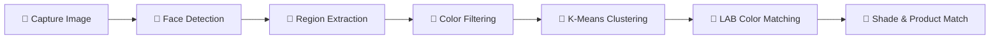

<div align="center">
  

  # ✨ Lumina Beauty — AI-Powered Skin Tone Analyzer

  **Discover your perfect cosmetic shade match with computer vision and AI**

  [](https://lumina-beauty.onrender.com)
  [](https://react.dev)
  [](https://python.org)
  [](https://opencv.org)
  [](LICENSE)

  [Features](#-features) · [Tech Stack](#-tech-stack) · [Getting Started](#-getting-started) · [API Reference](#-api-reference) · [Deployment](#-deployment) · [Contributing](#-contributing)

</div>

---

## 🎯 Overview

Lumina Beauty is a full-stack web application that uses **computer vision** to analyze your skin tone from a photo or live camera feed, then recommends personalized cosmetic shade matches. The system leverages OpenCV's face detection, K-means color clustering, and LAB color space matching to deliver accurate results in under 500ms.

---

## ✨ Features

| Feature | Description |
|---|---|
| 📸 **Real-Time Camera Analysis** | Capture your skin tone using your device camera with live preview |
| 🖼️ **Photo Upload** | Upload any photo for instant skin tone analysis |
| 🎨 **Precise Color Detection** | Multi-color-space filtering (HSV + YCrCb) for accurate skin isolation |
| 🔬 **K-Means Clustering** | Extracts dominant skin color using 5-cluster analysis |
| 💄 **Shade Matching** | Matches to a curated database using Delta E (CIE76) color distance |
| 🌡️ **Undertone Classification** | Determines Warm, Cool, or Neutral undertone with confidence scoring |
| 🛍️ **Product Recommendations** | Personalized cosmetic recommendations based on your skin profile |
| 📊 **Detailed Analysis Report** | Downloadable report with color breakdown and nearby shade alternatives |
| 🛒 **Shop Integration** | Browse curated products filtered by your skin tone results |

---

## 🏗️ Tech Stack

<table>
<tr>
  <td align="center" width="50%">
    <h3>Frontend</h3>
    <br/><br/>
    <b>React 19</b> · TypeScript · Vite · Tailwind CSS 4<br/>
    Framer Motion · Lucide Icons · React Router 7
  </td>
  <td align="center" width="50%">
    <h3>Backend</h3>
    <br/><br/>
    <b>Python 3.11</b> · Flask · OpenCV · NumPy<br/>
    Pillow · PyMongo · Gunicorn
  </td>
</tr>
</table>

---

## 🔬 How It Works



1. **Face Detection** — Haar cascade classifier locates the face in the image
2. **Region Extraction** — Samples forehead, left cheek, and right cheek (avoiding eyes, nose, mouth)
3. **Color Filtering** — HSV and YCrCb dual-space filters isolate true skin pixels
4. **K-Means Clustering** — Groups similar colors and identifies the dominant skin tone
5. **LAB Matching** — Converts to perceptually uniform LAB color space for Delta E shade matching
6. **Recommendations** — Maps the matched shade to personalized product suggestions

---

## 🚀 Getting Started

### Prerequisites

- **Node.js** ≥ 18
- **Python** ≥ 3.11
- **pip**

### Installation

```bash
# Clone the repository
git clone https://github.com/Manaswin05/Lumina-Beauty.git
cd Lumina-Beauty

# Install frontend dependencies
npm install

# Install backend dependencies
cd backend
pip install -r requirements.txt
cd ..
```

### Environment Setup

```bash
# Copy the environment template
cp .env.example .env
```

Edit `.env` and fill in your values:

```env
MONGO_URI=mongodb+srv://<user>:<password>@cluster.mongodb.net/lumina_beauty
SECRET_KEY=your_flask_secret_key
```

> **Note:** MongoDB is optional. The app works without it but won't persist analysis history.

### Running Locally

**Option 1 — Run both simultaneously:**
```bash
npm run dev:all
```

**Option 2 — Run separately:**
```bash
# Terminal 1: Frontend (http://localhost:3000)
npm run dev

# Terminal 2: Backend API (http://localhost:5000)
cd backend && python app.py
```

---

## 📡 API Reference

### `POST /api/analyze-skin`

Analyze skin tone from a base64-encoded image.

<details>
<summary><b>Request / Response</b></summary>

**Request Body:**
```json
{
  "image": "data:image/jpeg;base64,/9j/4AAQ..."
}
```

**Response:**
```json
{
  "success": true,
  "detectedColor": {
    "rgb": [210, 170, 135],
    "hex": "#D2AA87"
  },
  "undertone": "Neutral",
  "undertoneConfidence": 75.5,
  "shadeMatch": {
    "code": "M20",
    "name": "Sand",
    "category": "Medium",
    "hex": "#D2AA87",
    "undertone": "Neutral",
    "description": "Medium with neutral sandy undertones"
  },
  "confidence": 87.3,
  "nearbyShades": ["..."],
  "recommendations": ["..."]
}
```
</details>

### `GET /api/health`

Health check endpoint.

### `GET /api/requests`

Get analysis history *(requires MongoDB)*.

---

## ☁️ Deployment

This project is configured for one-click deployment on **Render** as a single web service.

### Deploy on Render

1. Fork this repository on GitHub
2. Go to [render.com](https://render.com) → **New +** → **Web Service**
3. Connect your GitHub repo and configure:

| Setting | Value |
|---|---|
| **Language** | Python |
| **Build Command** | `bash build.sh` |
| **Start Command** | `cd backend && gunicorn app:app --bind 0.0.0.0:$PORT --workers 2 --timeout 120` |

4. Add environment variables:

| Variable | Value |
|---|---|
| `PYTHON_VERSION` | `3.11.0` |
| `NODE_VERSION` | `20.11.0` |
| `MONGO_URI` | Your MongoDB Atlas connection string |

5. Click **Deploy** — Render builds the frontend, installs Python deps, and starts the server.

> The included [`render.yaml`](render.yaml) and [`build.sh`](build.sh) handle the full build pipeline automatically.

---

## 📁 Project Structure

```
Lumina-Beauty/
├── src/                        # React frontend
│   ├── components/
│   │   ├── Layout.tsx          # App shell — navbar, footer
│   │   └── AnalysisReport.tsx  # Downloadable analysis report
│   ├── pages/
│   │   ├── Home.tsx            # Landing page
│   │   ├── SkinAnalysis.tsx    # Camera + upload analysis
│   │   ├── Shop.tsx            # Product catalog
│   │   └── ProductDetail.tsx   # Individual product view
│   ├── utils/
│   │   └── colorAnalysis.ts    # Client-side color utilities
│   ├── App.tsx                 # Router configuration
│   ├── main.tsx                # Entry point
│   └── index.css               # Global styles
├── backend/                    # Python Flask API
│   ├── app.py                  # Main server — API + static serving
│   ├── shade_database.py       # Cosmetic shade & product database
│   ├── gunicorn_config.py      # Production server config
│   └── requirements.txt        # Python dependencies
├── build.sh                    # Full-stack build script (Render)
├── render.yaml                 # Render deployment blueprint
├── vite.config.ts              # Vite + Tailwind configuration
├── index.html                  # HTML entry point
└── .env.example                # Environment variable template
```

---

## 🤝 Contributing

Contributions are welcome! Here's how to get started:

1. **Fork** the repository
2. **Create** a feature branch (`git checkout -b feature/amazing-feature`)
3. **Commit** your changes (`git commit -m 'Add amazing feature'`)
4. **Push** to the branch (`git push origin feature/amazing-feature`)
5. **Open** a Pull Request

---

## 📄 License

This project is licensed under the **MIT License** — see the [LICENSE](LICENSE) file for details.

---

<div align="center">
  <br/>
  <b>Built with ❤️ using OpenCV, Flask, and React</b>
  <br/><br/>
  <a href="https://github.com/Manaswin05/Lumina-Beauty/stargazers">
    
  </a>
  &nbsp;&nbsp;
  <a href="https://github.com/Manaswin05/Lumina-Beauty/network/members">
    
  </a>
</div>
